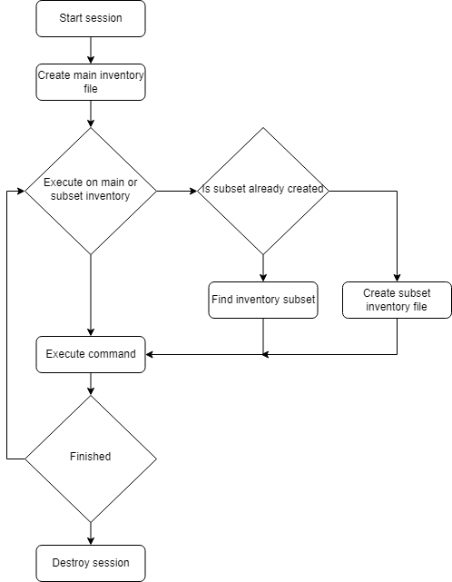
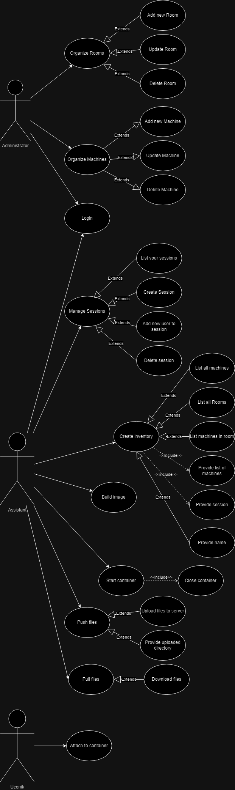

# remote-environment-manager

This application is used to organise and control developing environment on remote work machines. 
Work machines are sorted in rooms/offices.   
Server can execute ansible playbooks to one or multiple machines, room/office or multiple rooms/offices or combination of both.  
Server can:<ul> 
<li>build docker image</li>
<li>run, stop and delete docker containers</li>
<li>upload files to server</li>
<li>push and pull files to machines</li>
</ul>
For all those functionalities user needs to be authenticated.  

## Explaining the flow
First user needs to login.  
Then user needs to create session. To create session user needs to specify some name that will later use for referencing in other API calls. After this user is free to do anything. 
Recommended path is to create inventory file with machines that it plans to use. This is later used as default inventory if subset name or machine list is not provided.  
User can also create inventory subset by providing session name, name for referencing and list of machines.  
If user doesn't plan on using any inventory file it can specify list of machines directly into command.  
Executing processes is async and user gets response as soons the process start.
User can get information about active processes on /status API.  
After finishing user must delete session.  

# Use Case

1. Login with email and password on  
POST /Auth/login
2. Create session with session name on  
POST /Auth/session
3. (OPTIONAL) Add more users to session with email 
PUT /Auth/session?session={name}&email={email}
4. Get list of all machines or machines from specific room  
GET /Room/machines 
GET /Room/machines/{roomID}
5. Create inventory file with list of machines. This will be our default inventory and we don't need to specify those machines anymore.  
POST /Room/inventory?session={session_name}
6. Build docker image for wanted class by specifing image name and dockerfile name.  
 NOTE: Building image will be replaced with pulling image from docker registry to save up time. 
POST /build_image?session={session_name}&predmet={image_name}&image={Dockerfile}
7. Start docker container with now built image by specifing container name and image name  
POST /start_container?session={session_name}&predmet={image_name}&image={Dockerfile}
8. Upload files to server so we can push them. Added API helps maintain accessibility throuh all APIs.
POST /upload?session={session_name}
9. Push uploaded files to clients /home/machine/materijal. 
POST /push_files?session={session_name}
10. Pull files from clients /home/machine/rad. 
POST /pull_files?session={session_name}
11. Download pulled files in zipped format. 
GET /download?session={session_name} 
12. Destroy session.  
DELETE /Auth/session?session={session_name} 
 
<b>NOTE:</b> Status of any step from 6-10 can be seen on 
GET /status?session={session_name} 

## Examples of classes that can benefit containerization
<ul>
<li>Logičko i funkcijsko programiranje - preinstalled Haskell and Scala</li>
<li>Uvod u vestacku inteligenciju - python modules</li>
<li>Inteligentni sistemi - python modules</li>
<li>Web 1 - setup PHP and Mysql server</li>
<li>Web 2 - installed nodejs and npm</li>
...
</ul>